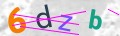
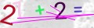
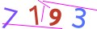
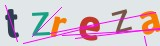
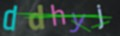
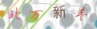

# Captcha for Laravel 12/13

[](https://packagist.org/packages/jason/captcha)
[](https://packagist.org/packages/jason/captcha)
[](https://packagist.org/packages/jason/captcha)
[](https://packagist.org/packages/jason/captcha)
[](https://laravel.com/)
[](https://github.com/jasonencode/captcha)

一个为 Laravel 12/13 深度定制的现代化验证码组件。基于 [Intervention Image v4](https://image.intervention.io/v4) 构建，采用模块化设计，易于扩展和维护。

## 特性

- **PHP 8.3+** 强类型支持，使用了 `Random\RandomException` 等现代 PHP 特性。
- **Intervention Image v4**：使用最新的图像处理库，支持 GD 和 Imagick 驱动。
- **模块化架构**：解耦了验证码生成（Generators）、配置管理（Support）和图像绘制（ImageCreator）。
- **性能优化**：内置静态资源缓存（字体、背景图），显著减少磁盘 I/O。
- **无状态 API 支持**：完美支持前后端分离项目。
- **高度可定制**：预置 8 种验证码样式，支持自定义配置。
- **中文字符验证码**：内置 `ChineseGenerator`，支持中文汉字验证码。
- **加密传输**：支持 `encrypt` 选项，对验证码 key 进行加密后传输。

## 预览

生成全部 8 种样式预览：

```bash
php preview.php
```

| default | math | number | flat | mini | inverse | admin | chinese |
|:-------:|:----:|:-----:|:----:|:----:|:-------:|:-----:|:-------:|
|  |  |  |  |  |  |  |  |

> 💡 预览图为随机生成，每次运行 `php preview.php` 会重新生成不同内容。

## 安装

通过 Composer 安装：

```bash
composer require "jason/captcha:^4.0"
```

在 Windows 环境下，确保 `php.ini` 中启用了 `php_gd.dll` 或 `php_imagick.dll`。

## 配置

发布配置文件：

```bash
php artisan vendor:publish --provider="Jason\Captcha\CaptchaServiceProvider" --tag="config"
```

`config/captcha.php` 中预置了 8 种验证码样式：`default`、`math`、`number`、`flat`、`mini`、`inverse`、`admin`、`chinese`。

每个样式可独立配置以下选项：

| 选项 | 类型 | 默认值 | 说明 |
|------|------|--------|------|
| `length` | int | 4 | 验证码字符个数 |
| `width` | int | 120 | 图片宽度（px） |
| `height` | int | 36 | 图片高度（px） |
| `quality` | int | 90 | JPEG 输出质量（0-100） |
| `math` | bool | false | 算术模式，生成加减乘算式 |
| `expire` | int | 60 | 有效期（秒） |
| `encrypt` | bool | false | 是否加密验证码 key 后传输 |
| `sensitive` | bool | false | 是否区分大小写 |
| `angle` | int | 15 | 字符最大旋转角度 |
| `lines` | int | 3 | 干扰线数量 |
| `lineWidth` | int | 1 | 干扰线宽度（px） |
| `lineColor` | string | `#ff00ff` | 干扰线颜色（十六进制） |
| `bgImage` | bool | true | 是否使用随机背景图片 |
| `bgColor` | string | `#ffffff` | 背景颜色（bgImage=false 时生效） |
| `fontColors` | array | — | 字体颜色列表，每个字符随机选取 |
| `contrast` | int | 0 | 对比度调整（负值降低、正值增加） |
| `sharpen` | int | 0 | 锐化强度 |
| `blur` | int | 0 | 模糊强度 |
| `invert` | bool | false | 反转图片颜色 |
| `characters` | array | — | 自定义字符集 |
| `marginTop` | int | 自动 | 文字上边距（px） |
| `textLeftPadding` | int | 4 | 文字左边距（px） |
| `fontsDirectory` | string | 包内路径 | 自定义字体目录 |
| `bgsDirectory` | string | 包内路径 | 自定义背景图目录 |

示例——`math` 样式（算术验证码）：

```php
'math' => [
    'length' => 9,
    'width' => 120,
    'height' => 36,
    'quality' => 90,
    'math' => true,
],
```

`chinese` 样式（中文字符验证码）：

```php
'chinese' => [
    'length' => 4,
    'width' => 120,
    'height' => 36,
    'sensitive' => true,
    'angle' => 20,
    'lines' => 4,
],
```

## 使用方法

### 1. 传统 Session 模式

在视图中显示验证码：

```html
<form method="POST" action="/register">
    @csrf
    <div>
        {!! captcha_img() !!}
        <input type="text" name="captcha" required>
    </div>
    <button type="submit">提交</button>
</form>
```

在控制器中进行验证：

```php
public function store(Request $request)
{
    $request->validate([
        'captcha' => 'required|captcha',
    ]);

    // 验证通过后的逻辑...
}
```

### 2. 无状态 API 模式

获取验证码数据（JSON 响应）：
`GET /captcha/api/default`

返回示例：
```json
{
    "sensitive": false,
    "key": "$2y$10$...", 
    "img": "data:image/jpeg;base64,..."
}
```

前端验证时，需将 `key` 一并传回后端：

```php
public function apiStore(Request $request)
{
    $request->validate([
        'captcha' => 'required|captcha_api:' . $request->input('key') . ',default',
    ]);

    // 验证通过后的逻辑...
}
```

## 辅助函数

- `captcha()`: 返回验证码图像响应。
- `captcha_src(string $style = 'default')`: 返回验证码图片的 URL 字符串。
- `captcha_img(string $style = 'default', array $attrs = [])`: 返回验证码图片的 HTML `` 标签。
- `captcha_check(string $value)`: 手动验证 Session 模式下的验证码。
- `captcha_api_check(string $value, string $key, string $style = 'default')`: 手动验证 API 模式下的验证码。

## 架构

采用模块化分层设计，各层职责清晰、易于扩展：

| 层 | 类 | 职责 |
|----|-----|------|
| **内容生成** | [CaptchaGenerator](src/Contracts/CaptchaGenerator.php) — `StringGenerator`、`MathGenerator`、`ChineseGenerator` | 生成验证码内容（字符串、算术表达式、中文汉字） |
| **图像渲染** | [ImageCreator](src/Image/ImageCreator.php) | 将内容绘制为验证码图片（背景/文字/干扰线/特效） |
| **配置管理** | [Support/Config](src/Support/Config.php) | 合并全局配置与样式配置 |
| **核心编排** | [Captcha](src/Captcha.php) | 协调生成与验证流程，支持 Session/API 两种模式 |
| **Facade** | [Facades/Captcha](src/Facades/Captcha.php) | 提供简洁的静态访问接口 |

## 鸣谢

本项目基于原 `mews/captcha` 进行现代化重构。

## 协议

[MIT License](LICENSE)
